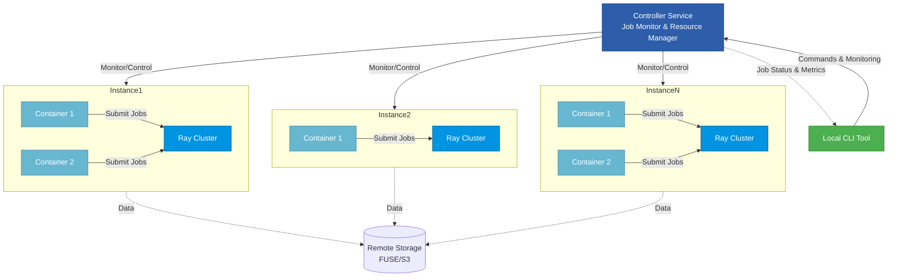

# toolbox

Containerization and setup tools for bootstrapping my ML research projects.

Install ai commit hook:

```bash
curl -s https://raw.githubusercontent.com/sidnb13/toolbox/refs/heads/master/utils/download.sh | bash
```

Backlog:

- Skypilot integration to spin up instances from cli
- Use a per-project config file for advanced configuration
- integration with ray job queue and gpuboard project for observability
- cleaner, less hardcoded defaults for dockerfiles, etc.
- Rich devcontainer support


